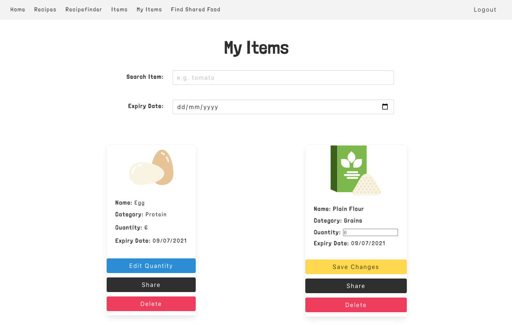

# Project 3: Food-Invy

## Overview
In this project, I teamed up with two colleagues, Dimi and Jonas to make a trio. We all shared interests in preventing food waste and I particularly wanted to incorporate *best before* dates on foods somehow so we set about creating a food inventory - with a twist.  

The general idea is to encourage thoughtfulness around food and waste by logging food that people have at home and encouraging cooking or sharing over throwing out. Based on this, we can recommend suitable recipes from our catalogue to encourage food use with the hope that our users may potentially find unexpected uses for items at the back of the fridge / cupboards.  

### Deployed Project
You can find this deployed [here](https://food-invy.netlify.app/).

Demo credentials: 
```
email: asfoodinvy@email.com
pass: asfoodinvy@email.com
```

### Architecture
This was our first project where we tasked to build a full stack application using the MERN stack. 

*MERN stack architecture*


### Web Technologies / Frameworks
* MongoDB
* Express
* React.js
* Node
* Model, View, Controller (MVC)
* Bulma
* HTML5 and CSS3
* JWT

### Tools
* Zoom
* Github
* Visual Studio Live Share
* Excalidraw - White boarding 
* Slack
* Cloudinary

### External API
* Mapbox

### Technical Requirements
* **Build a full-stack application** by making your own backend and your own front-end
* **Use an Express API** to serve your data from a Mongo database
* **Consume your API with a separate front-end** built with React
* **Be a complete product** which most likely means multiple relationships and CRUD functionality for at least a couple of models
* **Implement thoughtful user stories/wireframes** that are significant enough to help you know which features are core MVP and which you can cut
* **Have a visually impressive design** to kick your portfolio up a notch and have something to wow future clients & employers. **ALLOW** time for this.
* **Be deployed online** so it’s publicly accessible.

### Planning Process
We decided to have daily standups on Zoom and communicated and shared resources using Slack which we found to be very helpful while working remotely. We also used whiteboarding to convey our ideas to eachother and break down functionality together, using it as a central and evolving reference. This also helped with getting our project idea signed off as the initial pitch was quite shaky as our concept was very different from what we covered in class.  

Once we had the idea down, we started to think about how to break this up into Models, Views and Controllers on the backend. We realised at the start that our idea was quite difficult to explain and was confusing to others so it was critical to figure out our models and controller logic. With this in mind, we decided to figure out together all of the components of our project. We began by noting down the fields we wanted in our database and then moved onto sketching out the visualisations of the user journey. This helped everyone to check in and make sure we all understood what we were working towards.

*Whiteboarding*


### Functionality and Walkthrough
* Guests should only be able to view all recipes
* Register and login
* Search and browse items
* Add an item to a user's inventory
* Remove an item from a user's inventory
* Edit an inventory item
* Share an inventory item
* Suggest a recipe for a user based on their inventory items

### Distribution of Tasks
We all wanted to be hands on as this was our first full stack project so we all contributed to both the backend and frontend design and development. As time went on, we naturally moved into more specialised tasks, with a combination of working on separate components in isolation and pair programming.

Dimi and I started by setting up the structure of the backend, and we were reviewing eachother's code as we went along. We then regrouped and worked through the Models, Controllers and Routes.

#### Individual Areas of Focus
* Dimi worked on the homepage
* I worked on the forms, edit inventory items, authentication, icons
* Jonas worked on Mapbox and the Recipe Match logic

### Models
There are four main entities in Food-Invy:

* Item
* User
* Inventory Item
* Recipe

#### Item - Icon Considerations
I initially looked into consuming an external api for grocery items with the advantage of gaining access to thousands of item and rich data, however I wasn’t happy with the images they provided. I then considered making users upload their own images which would be a bad UX with unmanaged images. In the end I found some great icon packs on Flaticon and decided to host them on Cloudinary and use them as seeded data.

*Items api endpoint*


#### Inventory Item Model
Here’s an example of the Inventory Item model. This references the Item model’s data to initialise the item’s default attributes while extending it with additional fields containing user input data for a customised item. The User model is also referenced to link this data to the user’s record. 

```
const InventoryItemSchema = new mongoose.Schema({
  item: { type: mongoose.Schema.ObjectId, ref: 'Item', required: true },
  quantity: { 
    type: Number, 
    required: true,
    validate: [
      { validator: (type) => (type > 0) }
    ], 
  },
  expiryDate: { 
    type: Date, 
    required: true,
  },
  user: { type: mongoose.Schema.ObjectId, ref: 'User', required: true },
  // ? This will indicate whether an inventory item has been shared
  // ? Default to false for all items in the user's inventory
  isShared: {
    type: Boolean,
    default: false,
    required: false,
  },
})
```

### Controllers
 
#### Inventory Item Controller - Update
I worked on the Edit controller and as already mentioned, each Inventory Item belongs to a user and therefore only the owner should be able to edit their item. I accessed the current user ID from the payload on the request and compared it with the owner’s ID.

*Backend*
```
async function update(req, res, next) {
  try {
    // ? Get the current userId
    const currentUserId = req.currentUser._id
    // ? Get the inventoryItem we might want to update
    const inventoryItem = await InventoryItem.findById(req.params.inventoryItemId)
    // ? Check whether the inventoryItem exists
    if (!inventoryItem) {
      throw new NotFound('No item found.')
    }
    // ? Compare the userId of the user trying to update the inventory item
    // ? with the userId on the inventory item itself. 
    if (!currentUserId.equals(inventoryItem.user)) {
      return res.status(401).json({ message: 'Unauthorized. You must be the Inventory Item Owner' })
    }

    // ? Set the updated POST data on the inventory item
    inventoryItem.set(req.body)
    // ? Save the updated inventory item
    inventoryItem.save()
    res.status(202).json(inventoryItem)

  } catch (e) {
    next(e)
  }
}
```

*Frontend*
```
export function editPersonalisedItem(inventoryItemId, newQuantity) {
  const userId = getUserId()
  return axios.put(`${baseUrl}/${userId}/items/${inventoryItemId}`, newQuantity, headers())
}
```

On the front end I conditionally rendered the *Save Changes* button if the *Edit* button is clicked.  I listened for the `onChange()` event to save the new quantity in state. Once the save button is clicked, I called the `put` request, passing in the Inventory Item ID and the new quantity value. Finally, the page is refreshed to reflect the update.

*Handling updates*
```
const [isButtonClicked, setEditButtonClicked] = React.useState(false)
  const [newQuantity, setNewQuantity] = React.useState(null)

  const handleEdit = (e) => {
    try {
      setEditButtonClicked(!isButtonClicked)
      console.log(e.target.value)
    } catch (err){
      console.log(err)
    }
  }  
  
  const handleSave = async () => {
    try {
      await editPersonalisedItem(id, newQuantity)
      console.log(newQuantity)
      history.go(0)
    } catch (err){
      console.log(err)
    }
  }  
```

*Conditional rendering*
```
{!isButtonClicked ? 
  <>
    <div className="card-content">
      <p className="mb-2 is-capitalized has-text-weight-bold">Name: <span className="has-text-weight-normal">{name}</span></p>
      <p className="mb-3 is-capitalized has-text-weight-bold">Category: <span className="has-text-weight-normal">{category}</span></p>
      <p className="mb-3 is-capitalized has-text-weight-bold">Quantity: <span className="has-text-weight-normal">{quantity}</span></p>
      <p className="mb-3 is-capitalized has-text-weight-bold">Expiry Date: <span className="has-text-weight-normal">{new Date(expiryDate).toLocaleDateString()}</span></p>
    </div>
    <button 
      type="submit"
      className="button is-info mb-3"
      name='quantity'
      onClick={handleEdit}
    >
      Edit Quantity
    </button>
  </>
  :
  <>
    <div className="card-content">
      <p className="mb-2 is-capitalized has-text-weight-bold">Name: {name}</p>
      <p className="mb-2 is-capitalized has-text-weight-bold">Category: {category}</p>
      <label className="is-capitalized has-text-weight-bold" htmlFor="quantity">Quantity: </label>
      <input className="mb-2" type="number" id="quantity" 
        placeholder={quantity} 
        onChange={event => setNewQuantity({
          'quantity': `${event.target.value}`,
        })}
      />
      <p className="mb-2 is-capitalized has-text-weight-bold">Expiry Date: <span className="has-text-weight-normal">{new Date(expiryDate).toLocaleDateString()}</span></p>
    </div> 

    <button 
      type="submit"
      className="button is-warning mb-3"
      name='quantity'
      onClick={handleSave}
    >
      Save Changes
    </button>
  </>
}
```

*Edit Inventory Item frontend*



### Recipe Match Logic
We broke down the recipe matching logic into the following steps:

Comparing recipes by their ingredients with the user inventory items.
1. Get all user items (inventory items)
2. Get all recipes (catalogue recipes)
3. Look for a potential recipe (loop through each ingredient in the recipe and compare with inventory item)
4. If no match is found, break the loop, otherwise set Boolean to true and return

*Recipe controller*
```
async function checkForRecipe(req, res, next) {
  try {
    // ? get all inventoryItems
    const currentUserId = req.currentUser._id
    const inventoryItemList = await InventoryItem.find({ user: `${currentUserId}` }).populate('item')

    // ? get all recipes
    const recipeList = await Recipe.find()

    // ? found recipe true or false
    let foundPotentialRecipe
    // ? filter through the list of recipes
    const listOfFoundRecipes = recipeList.filter(recipe => {
      // * for every recipe, loop through all recipe ingredients
      for (let index = 0; index < recipe.ingredients.length; index++) {
        // * check if current recipe ingredient is in inventoryItemList
        // * as soon as inventoryItem is equal to recipe ingredient
        // * it returns that item (so not undefined)
        if (
          (inventoryItemList.find(inventoryItem => inventoryItem.item.name.toLowerCase() === recipe.ingredients[index].name.toLowerCase())) === undefined
        ) {
          // gets executed if find() returns undefined
          foundPotentialRecipe = false
          break
        } else {
          // gets executed if find() returns item
          foundPotentialRecipe = true
        }
      }
      // * filter() only returns, if true
      return foundPotentialRecipe
    })

    if (listOfFoundRecipes.length === 0) {
      return res.status(401).json({ message: 'No recipe found' })
    }

    res.status(200).json(listOfFoundRecipes)
  } catch (error) {
    next(error)
  }
}
```

Below is a walkthrough of the recipe matching user experience. Note: This works for multiple matches ad the recipes will be filtered.

**Recipe Finder - Step 1 - Unmatched inventory items:**


**Recipe Finder - Step 2 - Check recipe finder. No recipes matches found:**


**Recipe Finder - Step 3 - Change inventory items:**


**Recipe Finder - Step 4 - Check recipe finder. A recipe match has been found:**


**Alternatively, guest users will be able to view a list of all the recipes.**

### Shared Item
We wanted to encourage food waste prevention and cooking as opposed to over consumption and though it would be a great to integrate food sharing on a map using the Mapbox API. From the Item Inventory, a user can also share an item. All shared items for a user will appear on a scrollable card set on a pin on the map.

*SharingMap*
```
async function index(res, next) {
  try {
    // ? get shared inventory items of all users
    const listOfAllSharedInventoryItemsOfAllUsers = await InventoryItem.find({ isShared: true })
      .populate('user')
      .populate('item')
    console.log('listOfAllSharedInventoryItemsOfAllUsers',listOfAllSharedInventoryItemsOfAllUsers)

    // ? filter for unique userIds within listOfAllSharedInventoryItemsOfAllUsers
    const listOfSharingUsersItems = listOfAllSharedInventoryItemsOfAllUsers.filter((item, index) => {
      if (index === 0) {
        return item
      } else {
        return item.user._id !== listOfAllSharedInventoryItemsOfAllUsers[index - 1].user._id
      }
    })

    const listOfItemslistPerUser = []
    for (let i = 0; i < listOfSharingUsersItems.length; i++) {
      // ? create array
      // ? fill it with inventory items of that user
      const listOfUserItems = listOfAllSharedInventoryItemsOfAllUsers.filter((item) => {
        return item.user._id === listOfSharingUsersItems[i].user._id
      })
      // ? add it to new array
      listOfItemslistPerUser.push(listOfUserItems)
    }

    res.status(200).json(listOfItemslistPerUser)
  } catch (error) {
    next(error)
  }
}
```

*Find shared food*


## Wins
* Contributing to my first full stack application
* Seeing this idea through from concept to fruition with lots of potential for future additions
* Figuring out how to create a clone of an Item model to create an Inventory Item model using referenced data
* Taking the lead as well as playing a support role 
* Getting comfortable with Bulma

## Challenges
The biggest challenge was defining the project idea as there are two main components to the overall concept and we were struggling to perceive a natural and well connected user journey. As we got better at articulating the purpose and agree on naming conventions that were clearer to understand for a new user, it became easier to consolidate. However, our rocky start carried meant that we had only a day and a half to style the front end. Since project two, I wanted to take my Bulma skills further so I decided to take responsibility for about 90% of the styling and set the theme and tone for the product. 

Working together to get the Recipe Finder working.

## Bugs
I worked on the Edit functionality of the Inventory Items and struggled with populating the *Quantity* field with the form data. Instead, as a workaround, I decided to use the placeholder attribute in the form to display this. The user impact of this decision is that the number toggle does not recognise the current value and so cannot be incremented. Otherwise, if typed in, a new value is saved and updated so the edit functionality does still work. 

## Key Learnings / Reflection
This was my first full stack project in a trio and I learnt a ton. Communication and organisation was key as we all had different levels of experience and comfortability as well as different schedules. We generally preferred splitting into a pair and a solo task at different milestones to work around this. I also learnt how essential planning and breaking down logic is, particularly when figuring out achievable goals.

Token authentication and noSQL databases was also new and getting some hands on experience in handling data on the from end from the database was invaluable. I also learnt a lot about what you can do with Custom Errors by extending the Error class which I thought was really cool.  

## Future Features
* Expiry Date Tracker - Desktop Notification / Email alert
* Food Preference Filter - This is currently not being used to filter recipes from registration. Food categories should be a drop down from the user model options.
* Improve user experience of sharing an item